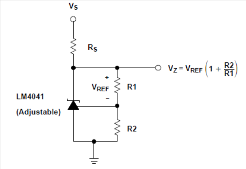
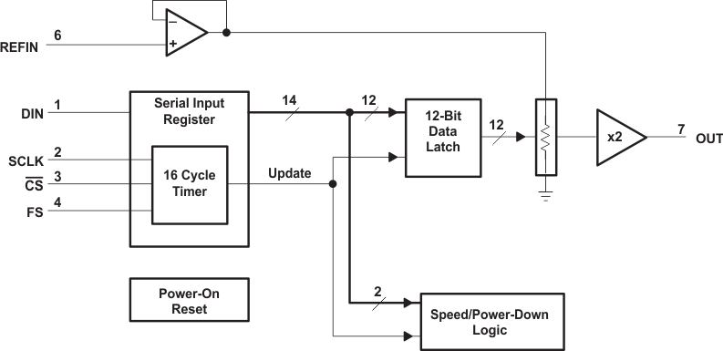
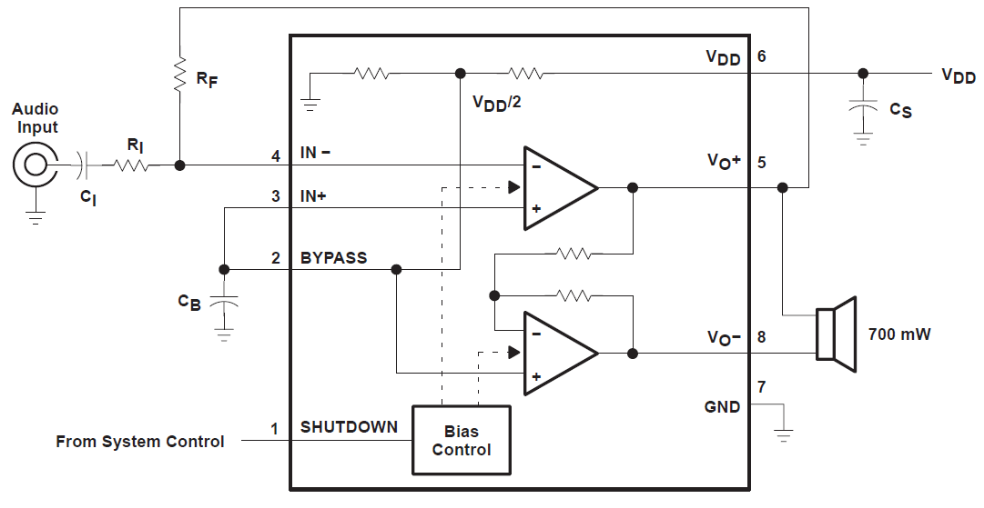
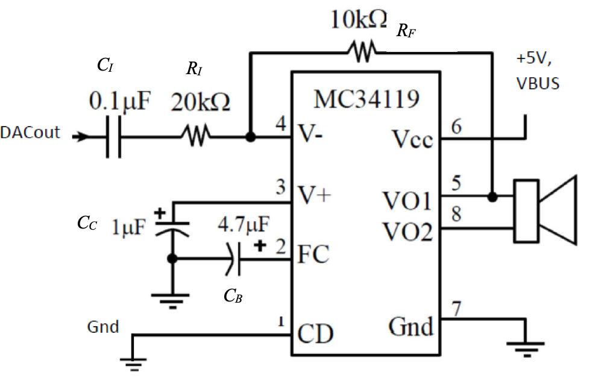
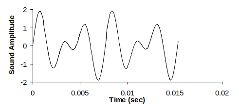
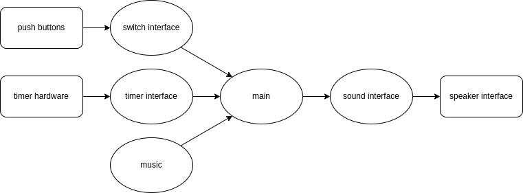
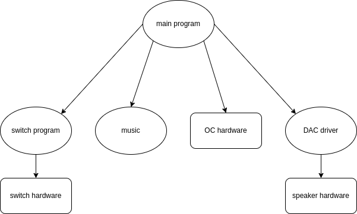
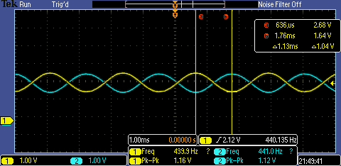

# Lab 5 Music Player and Audio Amp

- [Lab 5 Music Player and Audio Amp](#lab-5-music-player-and-audio-amp)
  - [0 Repository Structure](#0-repository-structure)
    - [0.1 HW](#01-hw)
    - [0.2 SW](#02-sw)
    - [0.3 Resources](#03-resources)
    - [0.4 Git and Github](#04-git-and-github)
  - [1 Summary](#1-summary)
    - [1.1 Goals](#11-goals)
    - [1.2 Team Size](#12-team-size)
    - [1.2 Review](#12-review)
    - [1.3 Starter Files](#13-starter-files)
    - [1.5 Required Hardware](#15-required-hardware)
    - [1.5 Background](#15-background)
    - [1.6 Requirements Document](#16-requirements-document)
  - [2 Preparation](#2-preparation)
  - [3 Procedure](#3-procedure)
    - [3.1 Deliverable 1](#31-deliverable-1)
    - [3.2 Deliverable 2](#32-deliverable-2)
    - [3.3 Deliverable 3](#33-deliverable-3)
    - [3.4 Deliverable 4](#34-deliverable-4)
    - [3.5 Delilverable 5](#35-delilverable-5)
    - [3.6 Deliverable 6](#36-deliverable-6)
  - [4 Checkout](#4-checkout)
  - [5 Report](#5-report)
    - [5.1 Deliverables](#51-deliverables)
    - [5.2 Analysis and Discussion Questions](#52-analysis-and-discussion-questions)
    - [6 Extra Credit](#6-extra-credit)

---

## 0 Repository Structure

The typical explanation for the repo structure. Lab specific instructions can be
found further below.

### 0.1 HW

The `hw` folder should contain your schematic and board files for your PCB or
circuits. In labs 1-5 and 10, you will be creating schematics for your circuit
in EAGLE. A setup tutorial can be found
[here](https://www.shawnvictor.net/autodesk-eagle.html).

### 0.2 SW

The `sw` folder should contain your application firmware and software written
for the lab. The `sw/inc` folder contains firmware drivers written for you by
Professor Valvano. Feel free to write your own (in fact, in some labs, you may
be required to write your own).

You can place any other source files in the `sw/` folder. TAs will look at the
files you create and/or modify for software quality and for running your
project.

### 0.3 Resources

A couple files are provided in the Resources folder so you don't have to keep
searching for that one TI document. Some of them are immediately useful, like
the TM4C datasheet. Others may be useful for your final project, like the
TM4C_System_Design_Guidelines page.

### 0.4 Git and Github

We will extensively use Git and Github for managing lab projects. This makes it
easier for TAs to grade and help debug the project by allowing us to see commit
histories, maintain a common project structure, and likewise, it makes it easier
for students to collaborate with partners, merge different codebases, and to
debug their work by having a history of commits.

Two common ways of using Git and Github are [Github Desktop](https://desktop.github.com/) and the [command line](https://git-scm.com/downloads).
[Tutorials](https://dev.to/mollynem/git-github--workflow-fundamentals-5496) are also abundant on the net for you to peruse. We've provided a cheatsheet for git
in the Resources folder.

It is highly recommended to make the most out of Git, even if you've never used
it before. Version control will save you a lot of suffering, and tools like Git
or SVN are ubiquitous in the industry.

A gitignore file is added to the root of this repo that may prevent specific
files from being tagged to the repo. This are typically autogenerated output
files we don't care about, but sometimes other stuff (like .lib files) falls
through that we want. Feel free to modify if necessary.

---

## 1 Summary

### 1.1 Goals

1. DAC conversion
2. SPI/SS interface
3. Design a data structure to represent music
4. Develop a system to play sounds

### 1.2 Team Size

The team size for this lab is 2.

> Two shall be the number thou shalt count, and the number of the counting shall
> be two. Three shalt thou not count, neither count thou one, excepting that
> thou then proceed to two. Four is right out.

### 1.2 Review

1. Search [http://www.ti.com](http://www.ti.com) for a data sheet on the TLV5618CP 12-bit DAC
2. Valvano Section 6.2 on periodic interrupts using the timer
3. Valvano Section 7.5 on SSI interfacing
4. Valvano Section 8.4 on DAC parameters and waveform generation

### 1.3 Starter Files

- `lab_5.c`
- `TLV5616.c`
- `TLV5616.h`

### 1.5 Required Hardware

| Parts                     | Datasheet                                                     | Price     |
|---------------------------|---------------------------------------------------------------|-----------|
| EK-TM4C123GXL             | [EK-TM4C123GXL datasheet](resources/TM4C_Datasheet.pdf)       | $12.99    |
| 8Ω or 32Ω speaker         | N/A                                                           | N/A       |
| Resistors and capacitors  | N/A                                                           | N/A       |
| Switches                  | N/A                                                           | N/A       |
| TLV5616 12-bit DAC        | [TLV5616 datasheet](resources/part_datasheets/tlv5616.pdf)    | $9.00     |
| LM4041CILPR shunt diode   | [LM4041C datasheet](resources/part_datasheets/lm4041c.pdf)    | $1.00     |
| TPA731D audio amp         | [TPA731 datasheet](resources/part_datasheets/tpa731.pdf)      | $1.85     |
| MC34119 (discontinued)    | [MC34119 datasheet](resources/part_datasheets/mc34119.pdf)    | N/A       |

### 1.5 Background

Most digital music devices rely on high-speed digital to analog converters (DACs) to create the analog waveforms required to produce high-quality sound. You will interface a 12-bit DAC and use it to create a sine-wave output. In particular, you will interface a TI TLV5616 12-bit DAC to an SSI port. **Please refer to the DAC data sheets for the SPI synchronous serial protocol**. During testing, the output of the DAC will be connected to a voltmeter, an oscilloscope, or a spectrum analyzer. You are allowed to use any DAC chip you want, as long as it runs on a single +3.3V supply and has an SSI interface. Many DACs, such as the TLV5616, require a reference voltage. A stable 1.50V reference can be created using a reference chip such as the LM4041C. The LM4041CILPR is an adjustable shunt reference that can be powered from the +3.3V supply and requires three external resistors to create the 1.50V reference. Look up in the TLV5616 data sheet to find how much current the DAC needs on its REF input. In the data sheet you will find the input impedance Rin of the REF pin, you can calculate this load current IL = 1.5V / Rin. Next, look up page 8 of the LM4041CILPR data sheet to find IZ (80 µA) and VREF (1.233V). Current through R1+R2 will be IREF =VREF/(R1+R2). Select R1 and R2 to set the reference output.

VZ = VREF (1 + R2 / R1) = 1.50V

*Figure 5.1. Shunt voltage reference*

The RS resistor in *Figure 5.1* (Figure 14-3 of the [datasheet](resources/part_datasheets/lm4041c.pdf)) sets the available current for the shunt reference.  Make RS ≤ (3.3 - VZ) / (IL + IREF + IZ). The TLV5616 has no digital data output, and the data sheet shows which pins to use for an SPI interface. Decide which TM4C123 pins you will connect to **DIN**, **SCLK**, and **CS bar** (active low) of the TLV5616.

*Figure 5.2. Block diagram of the DAC interface for the TLB5616. See the [datasheet]() to find which pins connect to DIN, SCLK, and CS bar.*

You will use an audio amplifier to convert the DAC analog output to the two pins of the speaker, as shown in *Figure 5.3*. It doesn’t matter what range the DAC is, as long as there is an approximately linear relationship between the digital data and the speaker current. To do this you will have to run the amplifier in its linear range. The performance score of this lab is not based on loudness, but sound quality. The quality of the music will depend on both hardware and software factors. The precision of the DAC, the linearity of the audio amp, the frequency response of the audio amp and the dynamic range of the speaker are some of the hardware factors.  Software factors include the DAC output rate and the complexity of the stored music data. Consider using either the TPA731 or MC34119 when designing the audio amp, choosing RF and RI so the gain is one or less than one (gain = 2 * RF / RI). Select a ceramic capacitor for CI with a range of 0.1 to 0.47 µF. CB should be tantalum with a range of 1 to 4.7 µF. CS should be ceramic with a range of 0.1 to 0.47 µF. You can power the MC34119 or TPA731 with either +3.3V or +5V, however a +5V supply will have better performance and louder sound. *NOTE: You will need to determine what to do with the shutdown signal.*

*Figure 5.3a. The TPA731 is one way to convert DAC voltage into speaker current (ground SHUTDOWN).*

*Figure 5.3b. The MC34119 is another way to convert DAC voltage into speaker current (ground CD).*

The SSI module must be written at a low level, like the book.

If you output a sequence of numbers to the DAC that form a sine-wave, then you will hear a continuous tone on the speaker, as shown in Figure 5.4. The **loudness** of the tone is determined by the **amplitude** of the wave. The **pitch** is defined as the **frequency** of the wave. *Table 5.1* contains frequency values for the notes in one octave. The frequency of each note can be calculated by multiplying the previous frequency by $\sqrt[12](2)$. You can use this method to determine the frequencies of additional notes above and below the ones in *Table 5.1*. There are twelve notes in an octave, therefore moving up one octave doubles the frequency.

| Note              | Frequency |
|-------------------|-----------|
| C                 | 523Hz     |
| B                 | 494Hz     |
| B♭     | 466Hz     |
| A                 | 440Hz     |
| A♭     | 415Hz     |
| G                 | 392Hz     |
| G♭     | 370Hz     |
| F                 | 349Hz     |
| E                 | 330Hz     |
| E♭     | 311Hz     |
| D                 | 294Hz     |
| D♭     | 277Hz     |

*Table 5.1. Fundamental frequencies of standard musical notes. The frequency for A is exact.*

*Figure 5.4. A sine-wave generates a pure tone.*

*Figure 5.5* illustrates the concept of **timbre**. You can define the type of sound by the shape of the voltage versus time waveform. Brass instruments have a very large first harmonic frequency.

The **tempo** of the music defines the speed of the song. In 2/4, 3/4, or 4/4 music, a **beat** is defined as a quarter note. A moderate tempo is 120 beats/min, which means a quarter-note has a duration of 1/2 second. A sequence of notes should be separated by pauses (silences) so that each note is heard separately. The **envelope** of the note defines the amplitude of the note over time. A very simple envelope is illustrated in *Figure 5.6*.

*Figure 5.6. You can control the amplitude, frequency and duration of each note (not drawn to scale).*

The smooth-shaped envelope, as illustrated in *Figure 5.7*, causes a less staccato and more melodic sound. The ARM Cortex M4 has plenty of processing power to create these types of waves.

*Figure 5.7.  The amplitude of a plucked string drops exponentially in time.*

A chord is created by playing multiple notes simultaneously. When two piano keys are struck simultaneously both notes are created, and the sounds are mixed arithmetically. You can create the same effect by adding two waves together in software, before sending the wave to the DAC. You can produce this effect by using two interrupts and adding two waves together in software. Figure 5.8 plots the mathematical addition of a 262Hz (low C) and a 392Hz sine wave (G), creating a simple chord.

*Figure 5.8. A simple chord mixing the notes C and G.*

### 1.6 Requirements Document

Edit the document.

---

## 2 Preparation

1. Edit the requirements document to reflect your design. The requirements document is fluid and we expect it to change as you develop your solution and discover what works and what doesn’t. You are allowed to modify the requirements document.
2. Draw the circuit required to interface the DAC to the TM4C123 SSI port. Include signal names and pin numbers. The bypass capacitor on the +3.3V supply of the DAC should be 0.1 µF. Draw the circuit required to interface two or three push button switches. Design the audio amplifier that runs on the +5V power from the VBUS. You will include in the report the final circuit diagram of your system, drawn with Eagle.
3. Collect all the external parts needed including TLV5616, LM4041, MC34119, resistors and capacitors. You do not need to construct the circuit as part of the preparation.
4. Write the two header files for three low-level device drivers: DAC, switches. Define at least two functions for the SSI/DAC interface and two functions for the switch interface. Write `DAC.h` and `Switch.h`.
5. Design the data structure you will use to store the song. This includes the struct, data type, and the array. This does not include the actual constants needed to define the song.
6. Find the sheet music for the song you plan to play.
7. Find one or two boxes you can cut up to hold the speaker. E.g., a pop tart box and/or small cereal box.

A “syntax-error-free” software is required as preparation. The TA will check off your listing at the beginning of the lab period. You are required to do your editing before lab. The debugging will be done during lab. Document clearly the operation of the routines. *Figure 5.89 shows one possible data flow graph of the music player.

*Figure 5.9. Data flows from the memory and the switches to the speaker.*

*Figure 5.10* shows a possible call graph of the system. Dividing the system into modules allows for concurrent development and eases the reuse of code.

*Figure 5.10. A call graph showing the three modules used by the music player.*

---

## 3 Procedure

1. Write the C file for the DAC interface. Look very carefully at the four Freescale SPI modes possible. Only one of these four modes matches exactly the shape and polarity of the clock needed by the TLV5616. The function `DAC_Init()` initializes the SSI protocol, and the function `DAC_Out()` sends a new data value to the DAC. Create separate `DAC.h` and `DAC.c` files. Write a second low-level device driver for the two or three switches, creating separate `Switch.h` and `Switch.c` files.
2. Design and write the music device driver software. Create separate `Music.h` and `Music.c` files. Place the data structure format definition in the header file. For example, you could implement a `Music_Play()` function that takes as an input parameter a pointer to a song data structure. Add minimally intrusive debugging instruments to allow you to visualize when interrupts are being processed.
3. Build the SSI/DAC hardware including voltage reference. Use simple main programs to debug the SSI/DAC interface. Experimentally measure the DAC output versus digital input for 8 different digital inputs.  Compare the measured data with the expected values. Calculate resolution, range, precision and accuracy of the DAC.

### 3.1 Deliverable 1

Show digital and analog data measurements. Calculate resolution, range, precision and accuracy of the DAC.

Using an oscilloscope and spectrum analyzer, measure the time-domain and frequency-domain outputs from your system at one frequency, like *Figure 8.35* in the textbook. Using the spectrum, calculate SNR (ratio of the sinewave output to the largest noise component).

### 3.2 Deliverable 2

Using a spectrum analyzer, measure amplitude versus frequency (show plot), and calculate SNR (in dB and equivalent number of bits, ENOB).

Using debugging instruments, measure the maximum time required to execute the periodic interrupt service routines. In particular, create a debugging profile to measure the percentage processor time required to play the song. Adjust the interrupt rate to guarantee no data are lost. Use your Lab 2 code to measure jitter of the DAC output.

### 3.3 Deliverable 3

Show the maximum execution time to run the ISR. Include a logic analyzer plot used to profile the system. Calculate percentage time in ISR.

### 3.4 Deliverable 4

Show the results of the maximum jitter for the ISR. If the jitter is not 0, give the reasons why.

Write and debug the music system. Cut up a box, placing the speaker inside, and notice how much better it sounds. Pins 5 and 8 will have the sound signal, but these two signals will be 180 degrees out of phase (so the difference between pins 5 and 8 will be AC sound, with DC=0), as shown in *Figure 5.10*.

### 3.5 Delilverable 5

 Using a dual channel scope measure the outputs on pins 5 and 8 (like Figure 5.10).

 *Figure 5.11. Two channel recording of pins 5 and 8. DC component is 2.4V (about ½ of +5V power), Vp-p is 1.6V (amplitude of the sound) and frequency is 523 Hz.*

 Remove the USB cable and carefully power your system using a lab power supply connected to the +5V line. Set the voltage to +5V, and measure the required current to run the system with and without playing music, in addition measure the RMS voltage on the +5V line, which is a measure of power line noise. Take a measurement with and without the music playing. Double check the positive and negative connections before turning it on. If you are at all unsure about this measurement ask your TA for help.

 ### 3.6 Deliverable 6

 Measure the 5V current with and without sound. Measure the RMS noise on the 5V line.

---

 ## 4 Checkout

 You should be able to demonstrate the three functions as described in the requirements document. The TA will ask you to connect your DAC output to an oscilloscope and spectrum analyzer, and ask you questions about the frequency spectrum of your output. You should be prepared to discuss alternative approaches and be able to justify your solution.

---

## 5 Report

### 5.1 Deliverables

1. Objectives (final requirements document)
2. Hardware Design
   1. Detailed circuit diagram of all hardware attached to the TM4C123 drawn with Eagle
3. Software Design
   1. If you organized the system different than Figure 5.8 and 5.9, then draw its data flow and call graphs
4. Measurement Data
   1. [Deliverable 1](#31-deliverable-1)
   2. [Deliverable 2](#32-deliverable-2)
   3. [Deliverable 3](#33-deliverable-3)
   4. [Deliverable 4](#34-deliverable-4)
   5. [Deliverable 5](#35-deliverable-5)
   6. [Deliverable 6](#36-deliverable-6)

### 5.2 Analysis and Discussion Questions

Give short 1 or 2 sentence answers to these questions.

1. Briefly describe three errors in a DAC.
2. Calculate the data available and data required intervals in the SSI/DAC interface. Use these calculations to justify your choice of SSI frequency.
3. Why did you use Freescale mode 1 and not mode 0 (bits 7,6 of `SSI1_CR0_R`)?
4. How is the frequency range of a spectrum analyzer determined?
5. Notice the audio amplifier had a voltage gain of 1. Why did we not simply drive the speaker directly from the DAC? I.e., what purpose is the TPA731/MC34119?

---

### 6 Extra Credit

You may (for a +5% bonus) create multiple sine-waves at the same time. This way, you can play music containing melody and harmony. For this bonus you will use two sine-wave generators and add them together in hardware or software; be careful not to overflow and cause clipping. You will need three interrupts: one for outputting the sine-wave for the melody, one for outputting the sine-wave for the harmony, and a third to interpret the music (updating the frequencies and envelopes for the other two.) You will have to add the two sine-waves together in software.

You may (for another +5% bonus) create sine-waves with envelopes similar to *Figure 5.7*. To get extra credit, these envelopes must have shapes that sound pretty and are independent of pitch. Notice in *Figure 5.7* that the decay slope of the envelopes for 330 and 523 Hz are the same. i.e. The envelopes are not frequency dependent. A sinusoidal envelope sounds like the bowing action on a violin.

You may (for another +5% bonus) develop a technique to support multiple notes with a single timer. In general, develop and implement a technique that allows more notes than timers.